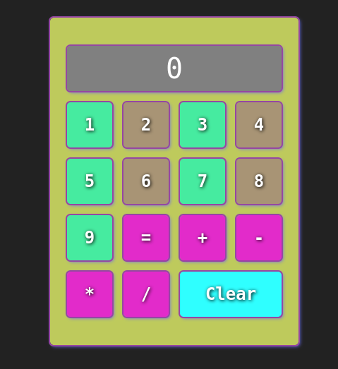

# Calculator Project

This is a simple calculator application built as a part of The Odin Project's curriculum. It's a web-based application that can perform basic arithmetic operations like addition, subtraction, multiplication, and division.

## Features

- Basic arithmetic operations: addition, subtraction, multiplication, division
- Interactive UI with number keys and operation keys
- Responsive design that works on different screen sizes
- Custom cursor

## Technologies Used

- HTML5
- CSS3
- JavaScript

## Setup and Run

1. Clone this repository to your local machine.
2. Open the `index.html` file in your preferred web browser.

## Screenshots

## Acknowledgements

This project is a part of [The Odin Project's](https://www.theodinproject.com/) curriculum.

## License

This project is open source and available under the [MIT License](LICENSE).

# Author 

https://x.com/km_fsdev 